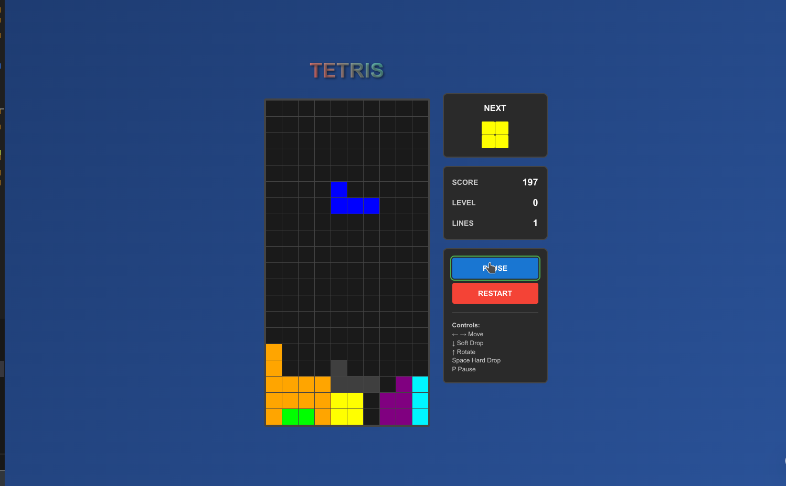

# React TypeScript Tetris Game

A modern, fully-featured Tetris game built with React, TypeScript, and Vite. Features smooth animations, responsive design, and classic Tetris gameplay.



## 🎮 Features

- **Classic Tetris Gameplay**: All 7 standard Tetris pieces (I, O, T, S, Z, J, L)
- **Responsive Design**: Works on desktop and mobile devices
- **Modern UI**: Clean, animated interface with smooth transitions
- **Score System**: Points awarded for lines cleared and soft drops
- **Level Progression**: Game speed increases as you advance
- **Next Piece Preview**: See what's coming next
- **Keyboard Controls**: Full keyboard support for gameplay
- **Pause/Resume**: Pause functionality for interruption-free gaming
- **Game Over Detection**: Automatic game end when pieces reach the top

## 🎯 How to Play

### Controls

- **←/→ Arrow Keys**: Move piece left/right
- **↓ Arrow Key**: Soft drop (faster fall)
- **↑ Arrow Key**: Rotate piece clockwise
- **Space Bar**: Hard drop (instant drop)
- **P Key**: Pause/Resume game
- **R Key**: Restart game

### Scoring

- **Single Line**: 100 × level
- **Double Lines**: 300 × level
- **Triple Lines**: 500 × level
- **Tetris (4 lines)**: 800 × level
- **Soft Drop**: 1 point per cell

## 🚀 Getting Started

### Prerequisites

- Node.js (version 14 or higher)
- npm or yarn

### Installation

1. **Clone the repository**

   ```bash
   git@github.com:Marwan-Alsayadi/Tetris-Game.git
   cd Tetris-Game
   ```

2. **Install dependencies**

   ```bash
   npm install
   ```

3. **Start the development server**

   ```bash
   npm run dev
   ```

4. **Open your browser**
   Navigate to `http://localhost:5173` to play the game!

### Building for Production

```bash
npm run build
```

The built files will be in the `dist` directory.

## 🏗️ Project Structure

```
src/
├── components/
│   ├── GameBoard/
│   │   └── GameBoard.tsx          # Main game board component
│   ├── GameControls/
│   │   └── GameControls.tsx       # Game control buttons
│   ├── NextPiece/
│   │   └── NextPiece.tsx          # Next piece preview
│   └── ScoreBoard/
│       └── ScoreBoard.tsx         # Score and level display
├── hooks/
│   └── useGameLogic.ts            # Main game logic hook
├── types/
│   └── tetris.ts                  # TypeScript type definitions
├── utils/
│   ├── constants.ts               # Game constants
│   ├── gameLogic.ts               # Core game logic functions
│   └── tetrisPieces.ts           # Tetris piece definitions
├── styles/
│   └── GlobalStyles.ts            # Global styles and theme
└── App.tsx                        # Main application component
```

## 🛠️ Technologies Used

- **React 18**: Modern React with hooks
- **TypeScript**: Type-safe JavaScript
- **Vite**: Fast build tool and dev server
- **CSS-in-JS**: Styled components approach
- **ESLint**: Code linting and formatting

## 🎨 Design Features

- **Glassmorphism UI**: Modern frosted glass effect
- **Smooth Animations**: CSS transitions for piece movement
- **Responsive Layout**: Adapts to different screen sizes
- **Dark Theme**: Easy on the eyes for extended play
- **Visual Feedback**: Hover effects and button states

## 🧪 Testing Checklist

- [x] All 7 Tetris pieces spawn correctly
- [x] Piece rotation works in all orientations
- [x] Left/right movement with boundary detection
- [x] Soft drop and hard drop functionality
- [x] Line clearing animation and scoring
- [x] Level progression and speed increase
- [x] Game over detection
- [x] Pause/resume functionality
- [x] Restart game feature
- [x] Responsive design on mobile
- [x] Keyboard controls working
- [x] Next piece preview updates correctly

## 🐛 Known Issues

- None currently reported! If you find any bugs, please open an issue.

## 🤝 Contributing

1. Fork the repository
2. Create a feature branch (`git checkout -b feature/amazing-feature`)
3. Commit your changes (`git commit -m 'Add amazing feature'`)
4. Push to the branch (`git push origin feature/amazing-feature`)
5. Open a Pull Request

## 📝 License

This project is licensed under the MIT License - see the [LICENSE](LICENSE) file for details.

## 🙏 Acknowledgments

- Classic Tetris game mechanics
- React and TypeScript communities
- Modern web development practices

## 🔗 Links

- [Live Demo](https://Marwan-Alsayadi.github.io/Tetris-Game)
- [Report Bug](https://github.com/Marwan-Alsayadi/Tetris-Game/issues)
- [Request Feature](https://github.com/Marwan-Alsayadi/Tetris-Game/issues)

---

**Enjoy playing Tetris!** 🎮✨
